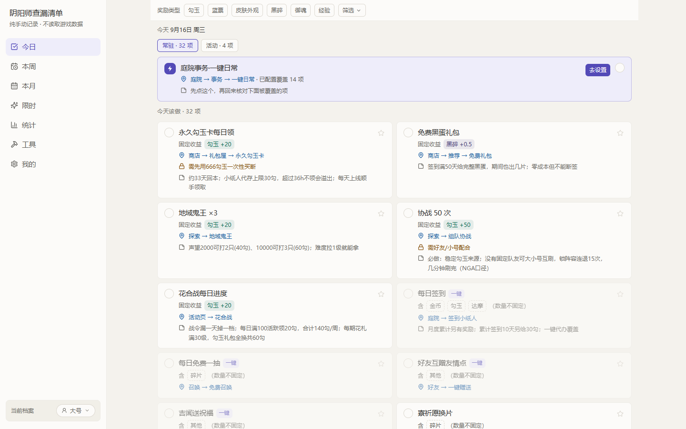
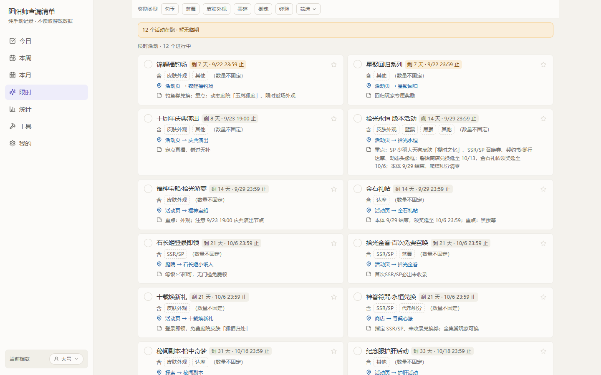
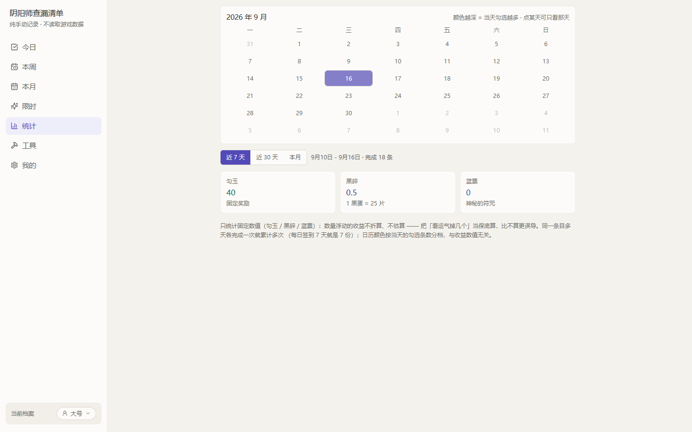
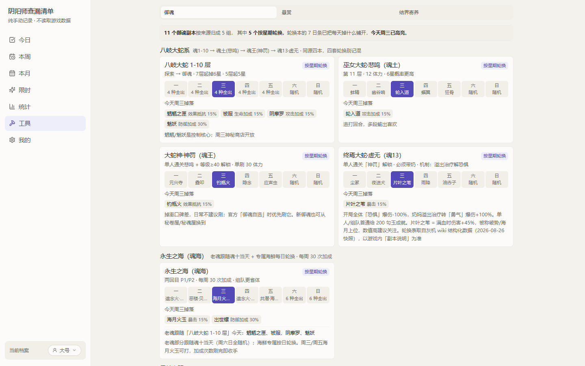
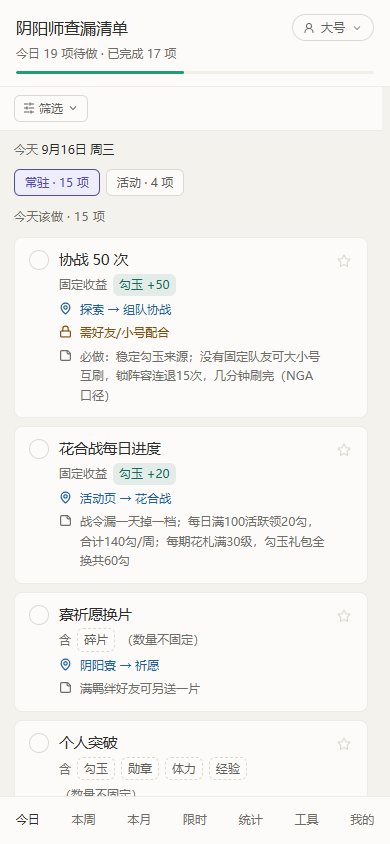

# 阴阳师查漏清单

> 此刻，我还有什么奖励没拿？

一个**纯手动勾选**的阴阳师奖励自查清单。它不替你玩游戏，只帮你记住"今天还有什么没做"——
比笔记本和记忆更靠谱，而且打开就能用。

**在线使用**：<https://yys.lykkk.fun> · 手机 / 电脑都能开，无需安装、无需登录



**它不做什么**（很重要）：不登录、不读取游戏账号或游戏内数据、不模拟点击、不代打。
所有完成状态都由你自己勾选。

---

## 目录

- [为什么需要它](#为什么需要它)
- [功能](#功能)
  - [今日](#今日)
  - [本周](#本周)
  - [本月](#本月)
  - [限时](#限时)
  - [统计](#统计)
  - [工具](#工具)
  - [我的 / 设置](#我的--设置)
- [清单是怎么排序的](#清单是怎么排序的)
- [那些"用起来才注意到"的细节](#那些用起来才注意到的细节)
- [快速上手](#快速上手)
- [数据与隐私](#数据与隐私)
- [常见问题](#常见问题)
- [已知限制](#已知限制)
- [数据说明与免责](#数据说明与免责)

---

## 为什么需要它

阴阳师的"该做的事"散在好几个地方：每日任务、每周任务、月度签到、限时活动、版本活动、
寮内集体活动、结界寄养收卡……而且**漏一次的代价并不相等** ——
漏一次月度黑蛋，和漏一次每日金币，完全不是一回事。

游戏本身不提供"我今天还差什么"的统一视图，靠脑子记就一定会漏。
这个清单把这些摊平到一屏，按"漏了有多亏"排好序，做完一条勾一条。

---

## 功能

七个页面：**今日 / 本周 / 本月 / 限时 / 统计 / 工具 / 我的**。

### 今日

- **常驻 · 活动 双 Tab**：常驻 = 长期每日模板（一键日常入口 + 每日条目）；活动 = 版本活动期才有的每日任务，活动结束自动下线，互不干扰。
- **一键日常入口卡**：官方一键日常会覆盖掉一批小任务。先点入口（它会把被覆盖的项一起勾上），再回来核对；卡右侧「去设置」直接跳到覆盖集合配置，可逐项调整。
- **每天 0 点翻篇**：页面顶部的日期只是展示，清单按 0 点重置 —— 凌晨做完了今天的事，第二天打开就是全新的。

### 本周

- 周常条目，**周一 0 点**刷新，顶部标出本周的自然周区间。

### 本月

- 月常条目（月度签到累计、秘卷屋·御魂礼盒这类），**每月 1 日 0 点**刷新。
- 单独成页是因为它的刷新节奏和周常不同 —— 混在一起时，"这条是下周翻篇还是下月翻篇"看不出来。

### 限时

- **顶部预警条**：`N 个活动在跑`，并标出其中几个将在 3 天内截止；没有临期项时会明说"暂无临期"。
- **固定按剩余天数升序**（"哪个快过期了"是清单最不可替代的能力，所以这一页不给排序控件）。每张卡标截止日与剩余天数，≤7 天转橙、≤3 天转红。
- **三个分区**：限时活动（带倒计时）· 版本 / 赛季（随版本滚动，单独成区）· 一次性。
- 已结束的活动条目会自动下线，不会赖在列表里；没标截止的按"截止未定"处理。



### 统计

- **月度日历**：颜色越深 = 当天勾选越多（类贡献图），悬停看当天条数。
- **区间收益**：可选近 7 天（默认）/ 近 30 天 / 本月，给出**勾玉 / 黑碎（1 黑蛋 = 25 片）/ 蓝票**的累计量。点日历某一天即切成"只看那天"，再点一次回到快捷区间。
- 同一条目多天各完成一次就累计多次（每日签到 7 天 = 7 份），所以这里没有"总量 / 还差"—— 那是进度，不是账。
- **只统计固定数值**：数量浮动的收益不折算、不估算。把"看运气掉几个"当保底算，比不算更误导。
- 历史靠勾选日志（保留 90 天，随备份一起走），所以"前天做了多少"查得到；周期重置不会清它，取消勾选才回退。



### 工具

三段资料查询。

**御魂** —— 副本轮换与掉落

- 11 个副本按八岐系 → 永生之海 → 日轮 → 其他 → 业原火分组，每组标明模式：按星期轮换 / 跟随八岐 / 固定掉落 / 特殊产出。
- **7 日条**：一次铺开七天掉落名单，不用来回切日期就能判断"这周值不值得刷"。
- 每张卡直接标出**二件套效果**（含首领御魂那种一整段长被动），省掉再去别处查的一步。
- 每天附一条当日提示。



**悬赏** —— 式神出处反查

- **全量直选**：39 个式神名单常驻，点一下就选中 —— 大部分悬赏本来就写着式神名，从列表点比先想关键词再搜快。
- **线索反查**：只有「神秘妖怪」需要按特征词查，空格分词取交集（游戏一次给两个线索）。
- 搜索**不过滤**名单，只做置顶 + 高亮 —— 名单是可用集合，不该被一个辅助查询收走。
- **并集区**：同时接了好几个悬赏时，能一把刷完的出处置顶高亮，一眼可判。

**结界寄养** —— 6 小时收续点

- 填上卡时间，自动排出往后每 6h 的收 / 续点（最多 5 个 ≈ 30h，够覆盖一张 6 星卡），跨天标「明天 / 后天 / 日期」。
- **任务 / 计划两态分开**：任务记状态；计划纯查看，决定开刷时点「开始」转正 —— 常常只是"打算这个点寄"，不必一存就被判成未到。
- **每个时间点各自记完成**：点列表以「上卡点」打头；点某个收/续点 → 用「现在」或填实际时间 → **只有它之后的点**按实际时间 + 6h 顺延（预计 14:00、实际 14:05 才收 → 下一个是 20:05），之前已完成的点不动，也可以取消完成重记。
- **下一个收/续点常驻在页面顶部**（手机在档案切换器旁、电脑在侧栏底部）：显示「⏳ 剩 2h15m」，到点变成「该收卡了」，点一下直接跳过去。没有进行中的任务时它不占位置。

### 我的 / 设置

分区默认全部收起（每个分区的标题行带关键结论，不展开也能确认状态）：

| 分区 | 能做什么 |
| --- | --- |
| **档案** | 多账号 / 多区服档案（名称、服务器、渠道），切换、新建、归档。所有勾选与偏好按档案分开存 |
| **一键日常** | 在"官方一键日常**会覆盖的条目**"里逐项确认（未标覆盖的每日任务不在候选内，避免把没做的任务勾成完成），以及被覆盖项在列表里**弱化还是隐藏** |
| **条目管理** | 新增自建条目（周期、路径、奖励类型、截止日）、隐藏预设条目、恢复默认条目库、调整清单顺序 |
| **视图偏好** | 决定清单**卡片里显示哪些内容**：三档预设（极简 / 简要 / 完整）+ 逐项开关（时间截止徽章 / 固定收益 / 奖励类型 / 入口路径 / 参与条件 / 备注），带真实卡片预览 |
| **寮时间** | 配置 5 个集体活动（麒麟·狩猎战、道馆突破、首领退治、狭间暗域、阴阳寮宴会）的时间，填好后清单里的时间徽章按你配的时刻标「未开始 / 进行中 / 已结束」 |
| **同步到其他档案** | 把当前档案的配置复制给其他号：目标档案与同步内容都由你勾选（寮时间 / 寄养任务 / 一键日常覆盖 / 自建条目与排序 / 隐藏条目 / 清单显示偏好），执行前二次确认。**勾选记录与统计不会同步** —— 那是每个号各自的进度 |
| **数据版本** | 看到当前条目库的数据版本，知道自己在用哪一版 |
| **数据备份** | 导出 JSON 文本 / 粘贴导入，换设备时用 |

---

## 清单是怎么排序的

不按"游戏里有几页"组织，而按**漏了有多亏**排 —— 越不可重复、越有截止日的条目越靠前：

```text
周期     一次性 / 限时 / 版本 / 赛季  >  每月  >  每周  >  每日
稀缺性   有截止日的更靠前
固定收益 标注了具体数值的更靠前
```

一键日常入口恒排第 0 位，不参与上面这套比较。

你也可以自己调：

- **☆ 置顶**某一条（单项星标，压过所有排序规则）
- 在「我的 → 条目管理」里拖动调整顺序，一旦调过，**自定义顺序直接接管**默认排序

---

## 那些"用起来才注意到"的细节

- **卡片可以只留名字**。默认每张卡显示名称 + 徽章 + 入口 + 条件 + 备注，信息全但很高；如果你只想快速打卡，设置页「视图偏好」里切「简要」（去掉三行长文本）或「极简」（只有名称），一屏能多看两三条。名称、勾选框、☆ 永远保留。
- **长按条目 = 跨档案勾选**。在清单里长按某一条（电脑上右键等效），会弹出档案选择器，确认后这条**同时写进选中的其他号** —— 多个号要做同一件事时不必来回切号。按住途中卡片会下压并走一条进度条，手指移动即取消。默认一个档案都不选，不勾就不点确认，零误写。
- **一键日常也能跨档案**。长按入口卡会把入口和它覆盖的所有条目**一起**写进目标档案，不会出现"入口勾了、里面的条目没勾"的半截状态。
- **寮时间按档案保存**。不同号可能在不同的寮，所以每个号各配一份；多个号在同一个寮时，用「同步到其他档案」一次铺开，不必逐个填。
- **配置 ≠ 状态**。单独取消某个被覆盖项的勾选，**不会**把它移出覆盖集合 —— 避免"状态变化偷偷改配置"。显示方式（弱化 / 隐藏）只影响列表样子，**不影响统计**。
- **手机 / 电脑都适配**。手机是单列 + 底部固定 Tab（处理了刘海与地址栏），电脑是左侧导航 + 多列栅格。

  
- **冷启动有三步引导**：选档案 → 配置寮时间 → 开始自查。

---

## 快速上手

1. 打开 <https://yys.lykkk.fun>
2. 进「我的 → 寮时间」，填入你所在寮的实际活动时间（道馆、宴会、退治、狭间暗域）——
   各寮时间不同，清单里给的只是参考值
3. 回到「今日」，从今天该做的事开始勾

有多个号的话，在「我的 → 档案」里新建，然后用「同步到其他档案」把配置铺过去。

---

## 数据与隐私

- **纯前端、不联网存储**：所有数据（勾选、配置、自建条目）都只存在**你自己浏览器的本地存储**里，不上传任何服务器。
- **换设备请先备份**：换设备、换浏览器、清理站点数据都会丢。在「我的 → 数据备份」里导出那段 JSON 文本，**发给自己**（微信 / 备忘录 / 邮件都行），到新设备粘回来即可恢复。
- **备份是文本不是文件**：导出给一段字、导入收一段粘贴的字 —— 手机上比"下载文件再想办法传过去"自然得多。
- 导入是**覆盖式**操作，会先让你看到这份备份里有什么（档案 / 勾选记录 / 日志天数 / 自建条目 / 已隐藏 / 自定义排序 / 寮时间 / 寄养任务），确认后还需手动输入「导入」二字才执行。
- 备份里含档案名称与区服信息，请像对待账号信息一样保管。

---

## 常见问题

**几点重置？**
每日与周常在 0 点刷新（周常在周一 0 点），月常在每月 1 日 0 点。版本 / 赛季不走 0 点 ——
要等版本上线维护完成（通常 9:00）才计入，所以在维护期间不会提前翻篇。

**能自动同步游戏进度吗？**
不能，这是有意的。任何形式的账号读取或模拟点击都不在项目范围内（也涉及账号安全风险），
完成状态一律由自己勾选。

**为什么统计里有些条目不算收益？**
只统计**固定数值**（勾玉 / 黑碎 / 蓝票）。数量浮动的收益不折算、不估算。

**寮活动时间为什么不统一写死？**
各寮自定，写死即错。清单里给的是参考值，请在「我的 → 寮时间」填你的真实时间；
多个号在同一个寮时用「同步到其他档案」铺开。

**收录了多少条目？**
常驻 69 条（每日 36 / 每周 29 / 每月 4）、非常驻 22 条（活动期 16 / 版本 5 / 赛季 1），
另有一键日常覆盖项 14 条。条目数据逐条人工核定，奖励类型共 18 类。
资料方面收录 11 个御魂副本 / 70 种御魂、39 个式神 / 64 个地点 / 148 组出处。

---

## 已知限制

- **纯前端单机**：数据只在本浏览器，没有云端同步；换设备 / 清理站点数据前请先导出备份。
- **暂不可安装**：已做移动端适配（刘海、地址栏、图标），但还没做 PWA，目前是普通网页而非可安装应用。
- **没有提醒推送**：不发送浏览器通知，靠「结界卡徽章」和「限时预警条」自己看。
- **不做游戏数据读取**是长期定位，不是待办事项。

---

## 数据说明与免责

- 本项目为个人自查工具，与网易 / 阴阳师官方无关。
- 条目中的时间、奖励与掉落信息可能随游戏版本变化，**以游戏内实际内容为准**；当前数据版本可在「我的 → 数据版本」查看。
- 寮活动（道馆、宴会、首领退治、狭间暗域等）时间各寮自定，清单里的值只是参考，请在设置里改成自己寮的时间。

---

<sub>想参与开发或了解实现？见 [`AGENTS.md`](./AGENTS.md)（红线与命令速查）与 [`docs/`](./docs/README.md)；变更记录见 [`CHANGELOG.md`](./CHANGELOG.md)。</sub>
