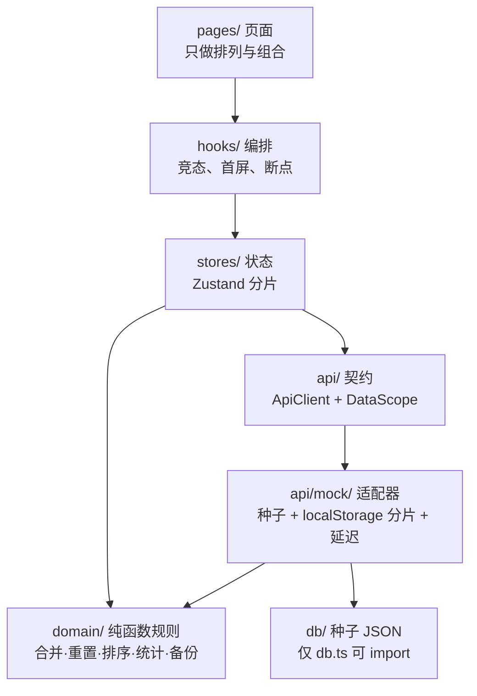
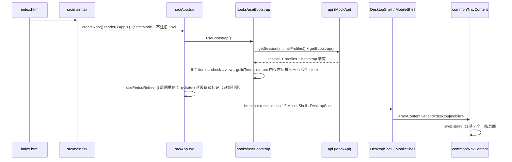

# 01 · 架构总览

> 对应数据版本：`2026.09.17-十周年二阶段` ｜ 事实核对日期：2026-09-17
> 本文回答：**代码放在哪、谁调用谁、一次点击之后发生了什么**。符号名与路径均可在代码中直接跳转核对。

## 1. 技术栈与工程配置

| 项 | 值 | 位置 |
| --- | --- | --- |
| 运行时 | Node 18+（实测 Node 22） | `package.json` |
| 框架 | React 18 + ReactDOM 18 | `package.json` dependencies |
| 语言 | TypeScript 严格模式 | `tsconfig.app.json` |
| 构建 | Vite 5 | `vite.config.ts` |
| 样式 | Tailwind CSS 3（+ `tailwindcss-animate`） | `tailwind.config.ts`、`postcss.config.js` |
| 状态 | Zustand 5 | `src/stores/` |
| 测试 | Vitest 2，`environment: 'node'`，`include: ['src/**/*.test.ts']` | `vite.config.ts` |
| 图标 | `lucide-react` | 各组件 |
| 路径别名 | `@` → `./src` | `vite.config.ts`、`tsconfig.app.json` |
| 其他运行时依赖 | `nanoid`（id 生成）、`tailwind-merge`（类名合并） | `package.json` |

脚本（逐字，来自 `package.json`）：

```bash
npm run dev          # vite
npm run build        # tsc -b && vite build
npm run preview      # vite preview
npm run lint         # eslint .
npm test             # vitest run
npm run test:watch   # vitest
npm run db:check     # node tools/build.js
npm run db:calibrate # node tools/calibrate-report.js
```

构建产物在 `dist/`；`reports/` 是工具脚本产物目录，已被 `.gitignore` 忽略。

## 2. 目录地图

### 2.1 顶层

```text
yys-checklist/
├── index.html            # 单页挂载点 #root，只挂 SVG favicon（PWA manifest / SW 未做）
├── src/
├── public/
├── schema/item.schema.json   # 条目 JSON Schema，仅供编辑器提示；运行时校验以 tools/build.js + domain/enums.ts 为准
├── tools/                # 数据校验、核对报告、一键验收、录入模板
├── docs/                 # 本套交接文档
├── AGENTS.md             # AI / 协作方开工前必读的约定
└── README.md             # 玩家向说明（玩法、口径理由、FAQ）
```

### 2.2 `src/` 逐层职责与文件清单

| 层 | 职责 | 文件 |
| --- | --- | --- |
| `src/` | 入口与根组件 | `main.tsx`、`App.tsx`、`vite-env.d.ts` |
| `src/api/` | 唯一的对外数据边界：契约 + 适配器 + DTO | `contract.ts`、`index.ts`、`types.ts`、`http/adapter.ts`、`mock/adapter.ts`、`mock/db.ts`、`mock/userStore.ts`、`mock/persist.ts`、`mock/latency.ts`、`mock/contract.test.ts`、`mock/persistence.test.ts` |
| `src/db/` | 种子主数据，只允许被 `api/mock/db.ts` import | `items.db.json`、`limited.db.json`、`yuhun.db.json`、`souls.db.json`、`bounty.db.json`、`meta.db.json`、`users.db.json`、`dataVersion.db.json` |
| `src/domain/` | 纯函数业务规则（无 IO，全部可单测） | `enums.ts`、`reset.ts`、`merge.ts`、`weight.ts`、`sort.ts`、`countdown.ts`、`stats.ts`、`autoDaily.ts`、`backup.ts`、`guildTime.ts`、`nurture.ts`、`yuhun.ts`、`bounty.ts`、`dateLabel.ts`、`checkLog.ts`、`calendar.ts` + 12 个 `*.test.ts` |
| `src/stores/` | Zustand 状态容器（按领域分片） | `session.ts`、`items.ts`、`check.ts`、`view.ts`、`device.ts`、`ui.ts`、`tools.ts`、`nurture.ts` + 5 个 `*.test.ts` |
| `src/hooks/` | 编排与副作用封装（竞态、首屏、断点、焦点、周期刷新） | `useApi.ts`、`useBootstrap.ts`、`useChecklist.ts`、`useAutoDaily.ts`、`useBreakpoint.ts`、`useDevicePrefs.ts`、`useModalFocus.ts`、`usePeriodRefresh.ts`、`useScope.ts` + `usePeriodRefresh.test.ts` |
| `src/pages/` | 页面容器（只管排列） | `TodayPage.tsx`、`WeekPage.tsx`、`MonthPage.tsx`、`LimitedPage.tsx`、`StatsPage.tsx`、`ToolsPage.tsx`、`MePage.tsx`；`pages/settings/`：`ProfileSection.tsx`、`AutoDailySection.tsx`、`ItemManagerSection.tsx`、`GuildTimeSection.tsx`；`pages/tools/`：`YuhunSection.tsx`、`BountySection.tsx`、`NurtureSection.tsx` |
| `src/components/` | 展示原子件与布局骨架 | `common/`（18）：`Alert.tsx`、`CheckBox.tsx`、`ChecklistItem.tsx`、`CollapsibleSection.tsx`、`ConfirmDialog.tsx`、`EmptyState.tsx`、`GainBadges.tsx`、`GainBar.tsx`、`HubCard.tsx`、`ItemField.tsx`、`NavContent.tsx`、`NurtureBadge.tsx`、`OnboardingDialog.tsx`、`ProfileSwitcher.tsx`、`ProgressBar.tsx`、`SaveErrorNotice.tsx`、`Tags.tsx`、`ViewBar.tsx`；`desktop/DesktopShell.tsx`；`mobile/MobileShell.tsx`；`settings/BackupSection.tsx`、`settings/DataVersionSection.tsx` |
| `src/services/` | 跨域用例编排与基础设施 | `localStore.ts`、`backupService.ts`、`clipboard.ts` + `localStore.test.ts` |
| `src/styles/` | 设计令牌与共享容器类 | `index.css`、`base.css`、`layout.ts`、`tokens.ts` |
| `src/test/` | 单测垫片 | `memoryStorage.ts` |

> 注意一处**目录归属不对称**（历史遗留，非 bug）：`BackupSection` 与 `DataVersionSection` 在 `src/components/settings/`，其余四个设置分区在 `src/pages/settings/`。新增设置分区时**跟随 `pages/settings/`**，不要扩大不对称。

## 3. 分层职责



铁律：**页面不直连种子文件；Mock 只做 IO、不含合并规则。**

## 4. 启动到首屏的调用链



关键文件与位置：

| 环节 | 位置 | 说明 |
| --- | --- | --- |
| HTML 挂载点 | `index.html` | `#root` + `<script type="module" src="/src/main.tsx">`；注释说明 PWA 打包暂缓 |
| 根渲染 | `src/main.tsx` | `React.StrictMode`，**不注册 Service Worker** |
| 首屏聚合 | `src/App.tsx` → `hooks/useBootstrap.ts` | 首屏唯一入口；切号 / `bootstrapTick` 变化时全量重载 |
| 周期刷新 | `hooks/usePeriodRefresh.ts` | 每分钟边界 + 窗口聚焦 + 可见性变化时重估周期状态，**不写盘** |
| 设备级状态 | `src/App.tsx` 挂载时 `hydrate()` → `stores/device.ts` | **只剩引导标记**（2026-09-16 起）。寮时间迁至 `stores/guildTime`、寄养迁至 `stores/nurture`，两者都改为**档案级**并随 `getBootstrap` 下发 |
| 首屏错误 | `App.tsx` | 渲染 `ErrorScreen` |
| 顶层提示 | `App.tsx` | `SaveErrorNotice`（聚合六处 `error`）、`OnboardingDialog`、`ConfirmDialog`、`ProfilePickDialog`（长按跨档案勾选的选择器，与确认框同一位置） |

## 5. 导航与页面分派

**没有 react-router**。导航是自研的 view store：

- `src/stores/ui.ts`：`NavKey`（type）、`NAV_ITEMS`（导航项数组）、`setNav`、state 字段 `nav` / `bootstrapLoading` / `bootstrapError` / `confirmState` / `bootstrapTick`。
- `src/components/common/NavContent.tsx`：`switch (nav)` 分派 7 个一级页面；首屏 `bootstrapLoading` 时渲染 `Skeleton`。
- 两套骨架各自渲染导航：`DesktopShell.tsx`（左侧固定 `w-56` 侧栏 + 底部 `ProfileSwitcher`）、`MobileShell.tsx`（顶部应用栏 + 进度条 + 底部固定 Tab，带 `safe-area` 与 `dvh` 处理）。
- 断点判据唯一来源：`src/hooks/useBreakpoint.ts`，`matchMedia('(min-width: 768px)')`；模块级首帧缓存避免闪烁。

> 页面内部不应自行读屏宽 —— 全项目只有 `useBreakpoint` 读窗口宽度。新增布局差异请走 `components/mobile` / `components/desktop` 与 `styles/layout.ts`。

## 6. 状态层：八个 store

| store | 导出符号 | state | action |
| --- | --- | --- | --- |
| `stores/session.ts` | `useSessionStore`、`aliveProfiles`、`currentProfile` | `session`、`profiles`、`error`、`saving` | `applySession`、`loadProfiles`、`switchProfile`、`createProfile`、`updateProfile`、`archiveProfile`、`restoreProfile`、`deleteProfile`、`setError` |
| `stores/items.ts` | `useItemStore`、`resetItemsMemory`、`dictIndexOf` | `meta`、`items`、`presetItems`、`overrides`、`error` | `applyBootstrap`、`reloadItems`、`loadPreset`、`addItem`、`hideItem`、`restoreItem`、`removeItem`、`saveOrder`、`resetLibrary` |
| `stores/check.ts` | `useCheckStore`、`resetCheckMemory`、`isChecked` | `checked`、`loading`、`error` | `applyChecked`、`toggle`、`setMany`、`toggleWithCascade`、`clearAll` |
| `stores/view.ts` | `useViewStore`、`resetViewMemory`、`normalizeView`、`CoverMode` | `view`、`defaults`、`error` | `applyView`、`setSortBy`、`setShowKinds`、`setMinWeight`、`toggleHideDone`、`togglePin`、`setCoverMode`、`setAutoSet`、`resetAutoSet` |
| `stores/device.ts` | `useDeviceStore` | `guildTime`、`onboarded`、`hydrated`、`error` | `hydrate`、`setGuildTime`、`clearGuildTime`、`markOnboarded`、`resetOnboarding` |
| `stores/ui.ts` | `useUiStore`、`NAV_ITEMS`、`NavKey`、`ConfirmOptions` | `nav`、`navRequest`、`bootstrapLoading`、`bootstrapError`、`confirmState`、`bootstrapTick` | `setNav`、`requestNav`、`clearNavRequest`、`setBootstrapLoading`、`setBootstrapError`、`refreshBootstrap`、`askConfirm`、`answerConfirm` |
| `stores/tools.ts` | `useToolsStore`、`ToolTab` | `yuhun`、`souls`、`bounty`、`loading`、`error` | `ensure`（模块级 `inflight` 去重） |
| `stores/nurture.ts` | `useNurtureStore`、`resetNurtureMemory` | `records`、`hydrated`、`error` | `hydrate`、`add`、`promote`、`remove`、`clearAll` |

依赖方向（谁调用谁）：

```text
hooks/useBootstrap ──> api.getSession / listProfiles / getBootstrap ──> 四个 store（items → check → view → session）
stores/session ──> stores/ui        （切号时点亮骨架 loading）
stores/items ──> stores/session     （取 DataScope）
stores/check ──> stores/session, stores/items（currentPeriod 依赖 meta + items）
stores/view  ──> stores/session
components/common/SaveErrorNotice ──> 聚合 session / items / check / view / device 五处 error
```

`useBootstrap` 的顺序很关键：**先按序清空 items → check → view 的内存态，再写回新数据**，避免切号瞬间旧档案的勾选残留。

## 7. 数据流：一次勾选发生了什么

```text
用户点击 ChecklistItem
  → hooks/useChecklist 提供的回调（或 useAutoDaily 的级联）
  → stores/check.toggle / setMany / toggleWithCascade（乐观更新内存）
  → api.setChecked / clearAllChecked（契约）
  → api/mock/adapter 写路径经 userStore.enqueue 串行化
  → api/mock/persist.KEY.state(profileId) 只重写当前档案的勾选分片
  → services/localStore.write 落 localStorage
```

读路径（首屏）：

```text
api.getBootstrap
  → mock/db.ts 取种子（items + limited 合并为 seedItems）
  → userStore.ensureStore() 把种子与 localStorage 覆盖层组装
  → domain/merge.mergeItems / effectiveView / buildMeta + domain/reset.mergeChecked
  → 返回 BootstrapPayload → stores/items.applyBootstrap / check.applyChecked / view.applyView / session.applySession
```

要点：

- 写操作**串行化**（`userStore.enqueue`），避免竞态覆盖。
- **分片存储**：勾一条只重写 `yys:state:{profileId}`，不触碰其他档案分片（`api/mock/persist.ts` 的 `KEY`，由 `api/mock/contract.test.ts` 单测守护）。
- 失败提示：写失败会写入对应 store 的 `error`，由 `components/common/SaveErrorNotice.tsx` 统一呈现。

## 8. 页面对应的编排 hook

| 页面 | 主要依赖 |
| --- | --- |
| `TodayPage.tsx` | `useChecklist`（`useAutoDaily` 提供一键日常卡片与级联） |
| `WeekPage.tsx` | `useChecklist('week')`（周常；月常已于 2026-09-15 拆到 `MonthPage`） |
| `MonthPage.tsx` | `useChecklist('month')`（月常；每月 1 日 0 点刷新，页面顶部标本月区间） |
| `LimitedPage.tsx` | `useChecklist`（限时分区，固定按剩余天数升序，无排序控件） |
| `StatsPage.tsx` | `domain/calendar.buildMonthGrid`（月历）+ `stores/check` 的 `log` + `domain/stats.summarizeRangeGain`（区间收益）—— **不经过 `useChecklist`**，因此不受「隐藏已完成 / 覆盖隐藏」影响 |
| `ToolsPage.tsx` | `stores/tools.ensure`（御魂 / 悬赏 / 寄养三段懒加载） |
| `MePage.tsx` | `pages/settings/*` **六个**分区（档案 / 同步到其他档案 / 一键日常 / 条目管理 / 视图偏好 / 寮时间）+ `components/settings/*` 两个分区 |

`hooks/useChecklist.ts` 是清单类页面的公共编排：过滤（`domain/sort.isVisible`）+ 排序（`domain/sort.buildComparator`）+ 分组，导出 `Checklist`、`ChecklistTarget`、`HIGH_WEIGHT`（= 30）。

## 9. 两套布局的共享与差异

- **共享**：数据层、状态层、领域逻辑、原子件（`ChecklistItem`、`HubCard` 等两端同款）。
- **差异**：只有排列方式。栅格在 `src/styles/layout.ts`（`CHECKLIST_GRID` 等容器类），令牌在 `src/styles/tokens.ts`，全局基样式在 `src/styles/base.css` / `index.css`。
- 移动端为单列 + 底部固定 Tab；桌面端为左侧固定导航 + 多列栅格。
- 可访问性约定：全局 `:focus-visible` 焦点环（组件内不写 `outline-none`）、模态焦点管理（`hooks/useModalFocus.ts`）、勾选卡整行命中、图标按钮带 `aria-label`。

## 10. 已知的「看起来奇怪但有意为之」的点

| 现象 | 原因与位置 |
| --- | --- |
| 一键日常入口永远排第 0 位 | `domain/sort.ts` 的前置特判，不参与 `weightOf` 比较 |
| 日期显示与勾选重置口径不一致 | 顶部日期纯展示（`domain/dateLabel.ts`），重置按周期口径（`domain/reset.ts`） |
| `ViewPrefs.sortBy` / `minWeight` 有字段但 UI 不写 | 排序已由「默认痛感 + 置顶 + 自定义顺序」决定；痛感自 2026-09-15 起只作排序键。两个字段保留在数据层（不动契约形状），**勿据此新增控件** |
| 界面里找不到任何「痛感」字样 | 2026-09-15 收敛：今日页「本周高痛感还剩 N 项」警示条已删除，`minWeight` 门槛与 `WEIGHT_LEGEND` 图例一并移除 —— 痛感只剩「默认排序」一个出口 |
| `api/http/adapter.ts` 全是「未实现」 | 本期只留类型占位，接后端时替换，见 `docs/04-handover-guide.md` |
| `stores/*` 里的 `CheckState` / `ItemState` 等接口没有导出 | 属内部实现细节，新增对外符号请显式 export |

下一篇：`docs/02-data-and-domain.md`（数据契约、种子结构与领域规则）。
